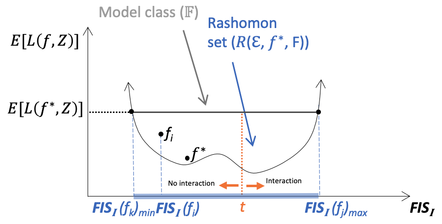
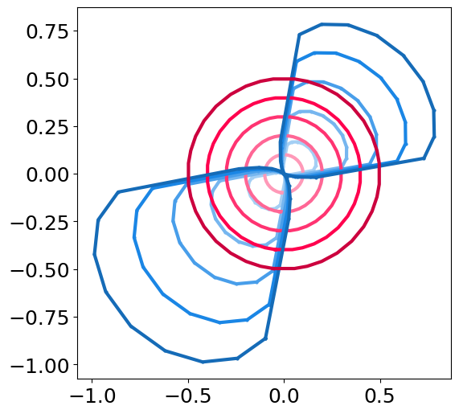

# Exploring the Cloud of Feature Interaction Scores in a Rashomon Set


This repository includes the implementation of the paper (https://arxiv.org/abs/2305.10181). The paper emphasizes the importance of investigating feature interactions not just in a single predictive model, but across a range of well-performing models, illustrated below.



## Summary

The paper introduces a novel approach to understanding feature interactions in machine learning models. The authors argue that the study of feature interactions in a single model can miss complex relationships between features. Thus, they recommend exploring these interactions across a set of similarly accurate models, known as a Rashomon set.

The main contributions of this paper are:

1. Introduction of the Feature Interaction Score (FIS) as a means to quantify the strength of feature interactions within a predictive model.
2. Proposal of the FIS Cloud (FISC), a collection of FISs across a Rashomon set, to explore how feature interactions contribute to predictions and how these interactions can vary across models.
3. Presentation of a non-linear example in a multilayer perceptron (MLP) to characterize the Rashomon set and FISC. This includes a search algorithm to explore FIS and to characterize FISC in a Rashomon set along with two novel visualization tools, namely Halo and Swarm plots.

----

## Project structure
The project is constructed following the below structure:
```
project
│   README.md
│   requirement.txt    
│   LICENSE
└───data
│   │   data_file.csv
└───src
│   │   feature_importance_helper.py
│   │   feature_interaction_score_utilities.py
│   │   FIS_explainer.py
│   │   general_utilities.py
│   │   Image_wrapper.py
│   │   visulizer.py
└───demo
│   │   toy_example.ipynb
└───experiments
│   │   ...
└───logs
│   │   ...
└───results
│   │   ...
───────────
```

## Requirements
FISC is a designed based on Python language and specific libraries. Four most commonly-used are listed as follows:

* Python
* Jupyter Notebook
* Numpy
* Matplotlib

FISC is a model-agnostic framework and experiments might have different requirements, depending on the data and model
types. To implement the experiments in the paper, dependencies in [requirements.txt](.\requirements.txt) are required.

```python
python -r .\requirements
```

----

## Demo

A toy example shows how halo plot illustrates the effect of feature interaction 
in [toy-example.ipynb](.\demo\toy_example.ipynb), results are shown below.


----

## Experiments

Code is provided to reproduce the experiments of our paper.
